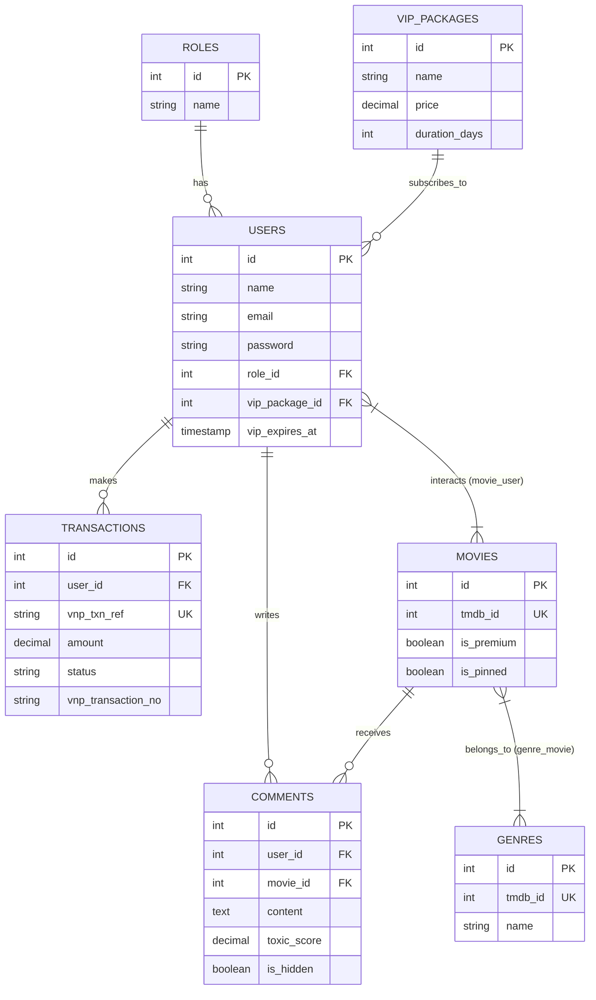
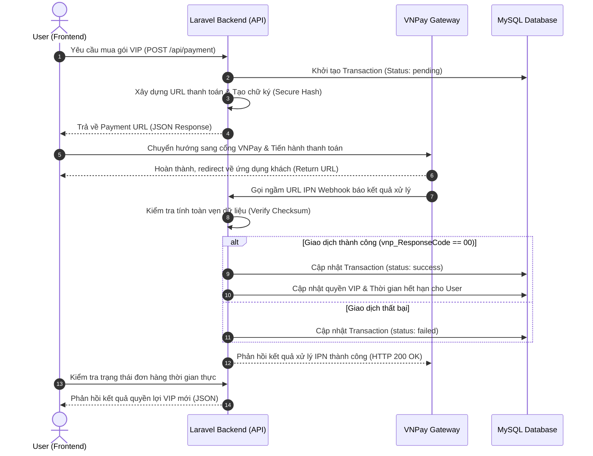

# 🎬 HỆ THỐNG BACKEND CORE: WEB MOVIE AI (FREEMIUM)

Dự án nghiên cứu và phát triển cổng giao tiếp dữ liệu (Backend API Core) phục vụ hệ thống nền tảng Xem phim trực tuyến ứng dụng Trợ lý ảo AI kiểm duyệt bình luận và tích hợp Cổng thanh toán quốc gia VNPay.

---

## 🛠️ 1. TỔNG QUAN CÔNG NGHỆ VÀ MÔI TRƯỜNG LÕI
* **Framework hạt nhân:** Laravel 11.x / RESTful API Architecture.
* **Mô hình tổ chức:** Model - View - Controller (MVC) kết hợp **Service Pattern** tách biệt logic nghiệp vụ.
* **Hệ quản trị cơ sở dữ liệu:** MySQL 8.0+.
* **Phân hệ bảo mật cổng API:** Laravel Sanctum (Token-based Authentication).
* **Thư viện tích hợp:** GuzzleHTTP (HTTP Client phục vụ kết nối TMDB API và Google Gemini AI API).

---

## 📊 2. SƠ ĐỒ THỰC THỂ QUAN HỆ (ERD DATABASE SCHEMA)
Sơ đồ mô tả cấu trúc các bảng vật lý, quy tắc ràng buộc toàn vẹn dữ liệu khóa ngoại và cơ chế phân cấp quyền hạn, quản lý gói VIP cùng luồng kiểm duyệt dữ liệu AI.



---

## 💸 3. SƠ ĐỒ TUẦN TỰ (SEQUENCE DIAGRAM) - LUỒNG THANH TOÁN VNPAY
Mô tả chi tiết đường đi của dữ liệu từ ứng dụng khách, quá trình băm bảo mật mã hóa tham số tại lớp Service, bắt gói tin bất đồng bộ từ cổng VNPay qua kênh IPN Webhook và đồng bộ hóa quyền lợi người dùng.



---

## 📂 4. CẤU TRÚC THƯ MỤC KIẾN TRÚC NÂNG CAO (SERVICE PATTERN)
Hệ thống triển khai phân tách lớp xử lý giúp mã nguồn tại Controllers tối giản, toàn bộ logic lõi tương tác với bên thứ ba được đóng gói tại tầng `app/Services/`:
```text
web-movie-AI/
├── app/
│   ├── Http/
│   │   └── Controllers/     # Tiếp nhận Requests và trả về phản hồi JSON
│   ├── Models/              # Khai báo cấu trúc Model và định nghĩa Relationships
│   └── Services/            # TẦNG XỬ LÝ NGHIỆP VỤ ĐỘC LẬP (CORE LOGIC)
│       ├── TMDBService.php      # Đóng gói logic gọi API lấy dữ liệu phim ngoài
│       ├── GeminiAiService.php  # Xử lý chấm điểm độc hại và kiểm duyệt nội dung
│       └── VNPayService.php     # Xử lý băm mã hash, tạo URL và verify IPN Webhook
├── database/
│   └── migrations/          # Hệ thống quản lý phiên bản cơ sở dữ liệu vật lý
└── routes/
    └── api.php              # Phân hệ quản lý định tuyến cổng API tập trung
```

---

## 🚀 5. HƯỚNG DẪN KHỞI CHẠY DỰ ÁN CHO THÀNH VIÊN (SETUP GUIDE)

**Bước 1: Tải các thư viện phụ thuộc và kích hoạt nhân dự án**
```bash
composer install
```

**Bước 2: Sao chép và cấu hình tệp tin môi trường**
Hệ thống yêu cầu tạo tệp `.env` từ khuôn mẫu có sẵn:
```bash
cp .env.example .env
```
Mở tệp `.env` ra, cấu hình tài khoản kết nối MySQL (`web_movie_ai`) và điền các mã khóa bảo mật được cấp phát tại mục `THIRD-PARTY APIs`.

**Bước 3: Khởi tạo khóa mã hóa dữ liệu hệ thống**
```bash
php artisan key:generate
```

**Bước 4: Đồng bộ hạ tầng bảng vật lý vào MySQL**
```bash
php artisan migrate
```

**Bước 5: Kích hoạt máy chủ ảo nội bộ phục vụ thực nghiệm**
```bash
php artisan serve
```