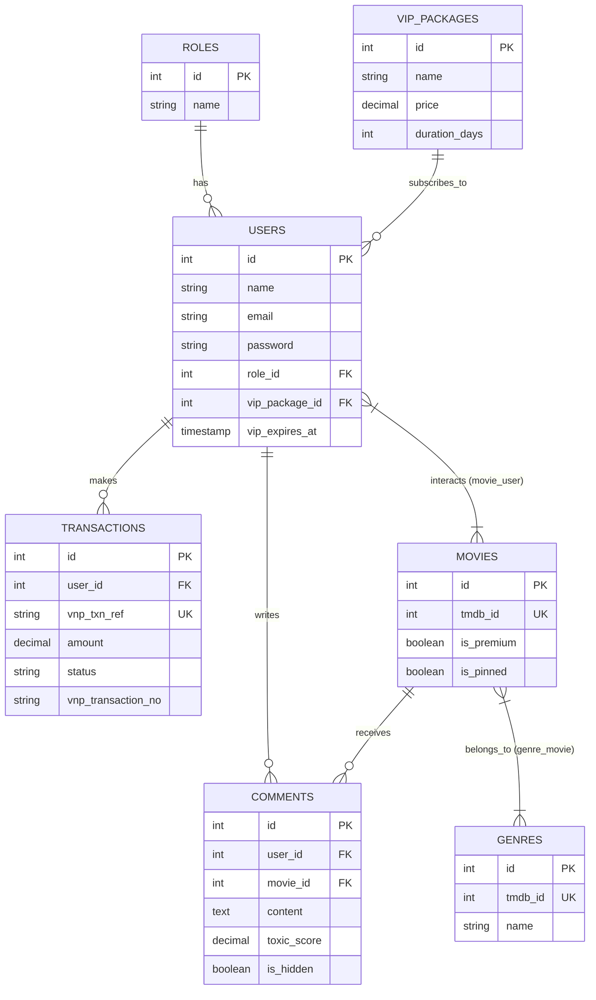
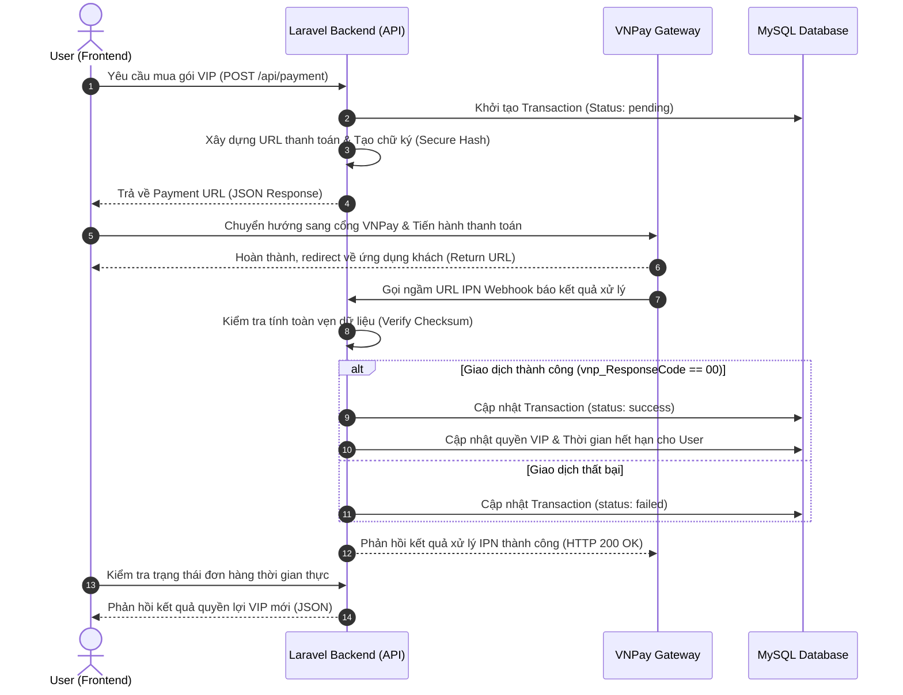

# 🎬 HỆ THỐNG BACKEND CORE: WEB MOVIE AI (FREEMIUM)

Dự án nghiên cứu và phát triển cổng giao tiếp dữ liệu (Backend API Core) phục vụ hệ thống nền tảng Xem phim trực tuyến ứng dụng Trợ lý ảo AI kiểm duyệt bình luận và tích hợp Cổng thanh toán quốc gia VNPay.

---

## 🛠️ 1. TỔNG QUAN CÔNG NGHỆ VÀ MÔI TRƯỜNG LÕI
* **Framework hạt nhân:** Laravel 11.x / RESTful API Architecture.
* **Mô hình tổ chức:** Model - View - Controller (MVC) kết hợp **Service Pattern** tách biệt logic nghiệp vụ.
* **Hệ quản trị cơ sở dữ liệu:** MySQL 8.0+.
* **Phân hệ bảo mật cổng API:** Laravel Sanctum (Token-based Authentication).
* **Thư viện tích hợp:** GuzzleHTTP (HTTP Client phục vụ kết nối TMDB API và Google Gemini AI API).

---

## 📊 2. SƠ ĐỒ THỰC THỂ QUAN HỆ (ERD DATABASE SCHEMA)
Sơ đồ mô tả cấu trúc các bảng vật lý, quy tắc ràng buộc toàn vẹn dữ liệu khóa ngoại và cơ chế phân cấp quyền hạn, quản lý gói VIP cùng luồng kiểm duyệt dữ liệu AI.



---

## 💸 3. SƠ ĐỒ TUẦN TỰ (SEQUENCE DIAGRAM) - LUỒNG THANH TOÁN VNPAY
Mô tả chi tiết đường đi của dữ liệu từ ứng dụng khách, quá trình băm bảo mật mã hóa tham số tại lớp Service, bắt gói tin bất đồng bộ từ cổng VNPay qua kênh IPN Webhook và đồng bộ hóa quyền lợi người dùng.



---

## 📂 4. CẤU TRÚC THƯ MỤC KIẾN TRÚC NÂNG CAO (SERVICE PATTERN)
Hệ thống triển khai phân tách lớp xử lý giúp mã nguồn tại Controllers tối giản, toàn bộ logic lõi tương tác với bên thứ ba được đóng gói tại tầng `app/Services/`:
```text
web-movie-AI/
├── app/
│   ├── Http/
│   │   └── Controllers/     # Tiếp nhận Requests và trả về phản hồi JSON
│   ├── Models/              # Khai báo cấu trúc Model và định nghĩa Relationships
│   └── Services/            # TẦNG XỬ LÝ NGHIỆP VỤ ĐỘC LẬP (CORE LOGIC)
│       ├── TMDBService.php      # Đóng gói logic gọi API lấy dữ liệu phim ngoài
│       ├── GeminiAiService.php  # Xử lý chấm điểm độc hại và kiểm duyệt nội dung
│       └── VNPayService.php     # Xử lý băm mã hash, tạo URL và verify IPN Webhook
├── database/
│   └── migrations/          # Hệ thống quản lý phiên bản cơ sở dữ liệu vật lý
└── routes/
    └── api.php              # Phân hệ quản lý định tuyến cổng API tập trung
```

---

## 🚀 5. HƯỚNG DẪN KHỞI CHẠY DỰ ÁN CHO THÀNH VIÊN (SETUP GUIDE)

### Bước 1: Cài đặt các thư viện phụ thuộc
Chạy lệnh composer để cài đặt các thư viện PHP cần thiết:
```bash
composer install
```

### Bước 2: Cấu hình tệp tin môi trường (.env)
Sao chép tệp môi trường mẫu để cấu hình hệ thống:
```bash
cp .env.example .env
```

Mở tệp `.env` vừa tạo và cấu hình các mục sau:
1. **Kết nối Cơ sở dữ liệu (MySQL):**
   ```env
   DB_CONNECTION=mysql
   DB_HOST=127.0.0.1
   DB_PORT=3306
   DB_DATABASE=web_movie_ai
   DB_USERNAME=root
   DB_PASSWORD=
   ```
2. **Cấu hình Cổng thanh toán VNPay Sandbox:**
   Đăng ký tài khoản Sandbox tại [VNPay Developer Portal](https://sandbox.vnpayment.vn/devreg/) để lấy thông tin cấu hình Merchant Admin hoặc sử dụng cấu hình mặc định:
   ```env
   VNP_TMN_CODE=RJXNTQ8K       # Mã định danh Merchant (TmnCode)
   VNP_HASH_SECRET=INHN2HPM...  # Chuỗi khóa bảo mật (HashSecret)
   VNP_URL=https://sandbox.vnpayment.vn/paymentv2/vpcpay.html
   VNP_RETURN_URL=http://localhost:5173/payment/return
   ```
3. **Cấu hình Trợ lý AI Gemini:**
   Lấy khóa API tại [Google AI Studio](https://aistudio.google.com/) và điền vào:
   ```env
   GEMINI_API_KEY=your_gemini_api_key_here
   GEMINI_BASE_URL=https://generativelanguage.googleapis.com/v1beta
   ```
   *Lưu ý: Dự án sử dụng model **`gemini-3.5-flash`** được tích hợp sẵn trong [GeminiAiService.php](file:///d:/web-movie-AI/app/Services/GeminiAiService.php) để tận dụng quota ổn định của phiên bản miễn phí.*

### Bước 3: Tạo mã khóa ứng dụng
```bash
php artisan key:generate
```

### Bước 4: Khởi tạo Cơ sở dữ liệu & Seed dữ liệu mẫu
Lệnh này sẽ tạo cấu trúc bảng vật lý cùng dữ liệu ban đầu bao gồm vai trò (Roles), gói dịch vụ (Subscription Plans), phim mẫu (Movies), tập phim mẫu (Episodes) và tài khoản thử nghiệm:
```bash
php artisan migrate:fresh --seed
```
*Tài khoản thử nghiệm mặc định được tạo từ seeder:*
- Email: `test@example.com`
- Mật khẩu: `password`

### Bước 5: Cấu hình Nhận Callback IPN (VNPay Webhook) trên Local
Cổng thanh toán VNPay yêu cầu một URL công khai để gửi phản hồi thanh toán (IPN Webhook) về backend của bạn. Bạn nên sử dụng Ngrok để kết nối đường hầm local:
1. Chạy ngrok trỏ đến cổng localhost của server:
   ```bash
   ngrok http 8000
   ```
2. Cập nhật URL Ngrok (ví dụ: `https://abcd-123.ngrok-free.app`) vào cấu hình webhook trong VNPay portal hoặc thay thế tương ứng trên cấu hình của bạn.

### Bước 6: Khởi chạy máy chủ ảo
```bash
php artisan serve
```
Hệ thống sẽ chạy cục bộ tại địa chỉ [http://127.0.0.1:8000](http://127.0.0.1:8000).

---

## 🧪 6. HƯỚNG DẪN KIỂM THỬ (TESTING GUIDE)

### Kiểm thử bằng Postman
Bộ sưu tập API đầy đủ được lưu tại thư mục [postman/collections/Web Movie AI - Full API](file:///d:/web-movie-AI/postman/collections/Web%20Movie%20AI%20-%20Full%20API).
* Nhập bộ sưu tập vào phần mềm Postman.
* Kích hoạt môi trường kiểm thử tương ứng.
* Chạy kiểm thử tự động cho các nhóm API chính: Auth, Comments & Ratings, Subscription & Payment, AI Assistant.

### Các Endpoint phát triển chính
* **Phân hệ VNPay:**
  - `POST /api/payment/vnpay/create`: Yêu cầu tạo URL thanh toán VNPay (Header yêu cầu `Authorization: Bearer <token>`).
  - `GET|POST /api/payment/vnpay/ipn`: Endpoint nhận kết quả thanh toán bất đồng bộ (IPN Webhook) từ VNPay.
  - `GET /api/payment/vnpay/return`: Endpoint nhận phản hồi kết quả hiển thị cho người dùng sau khi thanh toán xong.
* **Phân hệ Chat AI:**
  - `POST /api/ai/chat`: Gửi câu hỏi trò chuyện, gợi ý phim với Trợ lý ảo (giới hạn rate limit 20 tin nhắn/giờ/user).
  - `GET /api/ai/chat/history`: Lấy 100 tin nhắn lịch sử chat gần nhất của user hiện tại.
  - `DELETE /api/ai/chat/history`: Xóa lịch sử trò chuyện của user hiện tại.