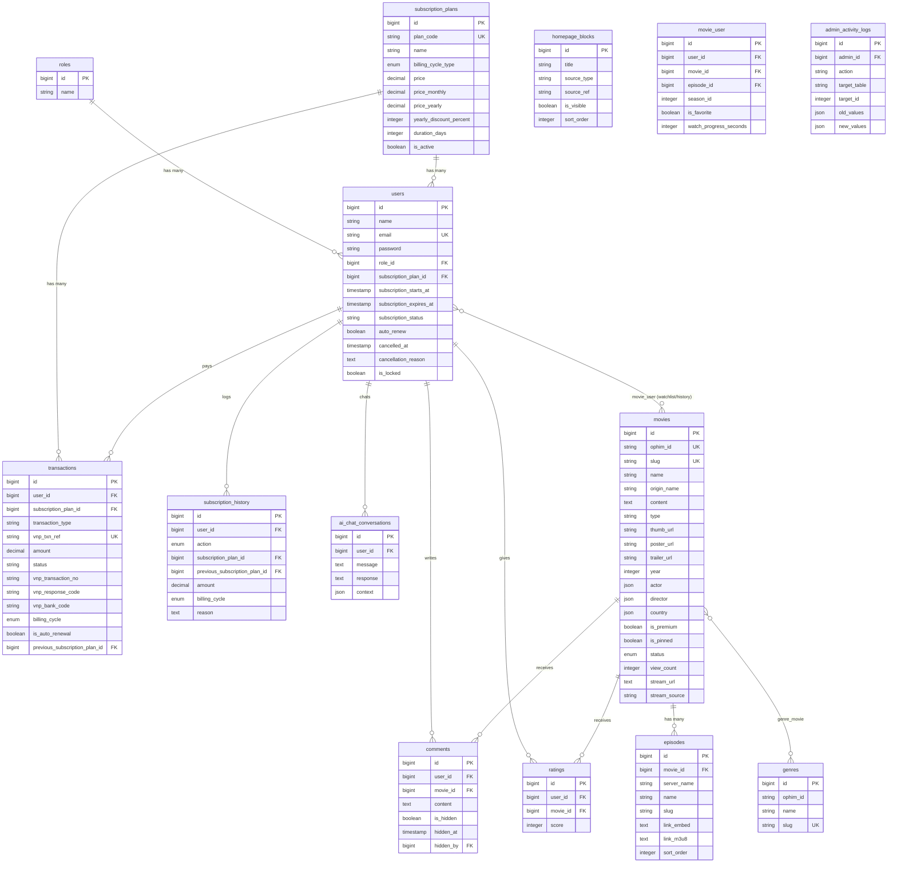

# KẾ HOẠCH TRIỂN KHAI BACKEND PHÍA USER

> **Dự án:** Web xem phim trả phí tích hợp AI tìm kiếm  
> **Phạm vi:** Backend API cho User (Guest → Free → Standard → VIP)  
> **Ngày lập:** 2026-06-04  
> **Tham chiếu:** [context.txt](context.txt) | [backend-admin.txt](backend-admin.txt)

---

## PHẦN 0 — KIỂM TRA & BỔ SUNG MIGRATION / POSTMAN THIẾU SÓT

### 0.1 Kiểm tra tương thích Ophim API ↔ Database

Sau khi phân tích JSON thực tế từ Ophim API (`https://ophim1.com`), phát hiện các vấn đề **NGHIÊM TRỌNG** sau:

#### ⚠️ VẤN ĐỀ 1: Bảng `movies` chưa đủ trường cho Ophim metadata

Bảng `movies` hiện tại chỉ có: `id, tmdb_id, is_premium, is_pinned, stream_url, stream_source, timestamps`.

Nhưng Ophim API trả về metadata phong phú mà hệ thống cần lưu vào DB nội bộ (theo yêu cầu ETL trong `backend-admin.txt`):

```json
{
  "movie": {
    "_id": "6a09d42ae14b2140fc6adcbd",
    "name": "Gia Nghiệp",
    "slug": "gia-nghiep",
    "origin_name": "The Heir",
    "content": "<p>Mô tả phim...</p>",
    "type": "series",
    "status": "completed",
    "thumb_url": "https://img.ophim.live/uploads/movies/gia-nghiep-thumb.jpg",
    "poster_url": "https://img.ophim.live/uploads/movies/gia-nghiep-poster.jpg",
    "trailer_url": "https://www.youtube.com/watch?v=...",
    "time": "? phút/tập",
    "episode_current": "Hoàn tất (42/42)",
    "episode_total": "42 Tập",
    "quality": "HD",
    "lang": "Vietsub + Thuyết Minh",
    "year": 2026,
    "actor": ["杨紫", "韩东君", ...],
    "director": ["Kaidong Hui"],
    "category": [{"id": "...", "name": "Chính kịch", "slug": "chinh-kich"}],
    "country": [{"id": "...", "name": "Trung Quốc", "slug": "trung-quoc"}]
  }
}
```

**→ CẦN BỔ SUNG MIGRATION** mở rộng bảng `movies`:

```php
// Migration: add_ophim_metadata_to_movies_table.php
Schema::table('movies', function (Blueprint $table) {
    // Thay tmdb_id bằng slug Ophim (unique identifier)
    $table->string('ophim_id')->nullable()->unique()->after('id');          // _id từ Ophim
    $table->string('slug')->unique()->after('ophim_id');                     // slug Ophim (URL-friendly)
    $table->string('name')->after('slug');                                   // Tên phim tiếng Việt
    $table->string('origin_name')->nullable()->after('name');                // Tên gốc
    $table->text('content')->nullable()->after('origin_name');               // Mô tả (HTML)
    $table->string('type')->default('single')->after('content');             // single | series
    $table->string('thumb_url')->nullable()->after('type');                  // URL thumbnail
    $table->string('poster_url')->nullable()->after('thumb_url');            // URL poster
    $table->string('trailer_url')->nullable()->after('poster_url');          // YouTube trailer
    $table->string('quality')->nullable()->after('trailer_url');             // HD, FHD, ...
    $table->string('lang')->nullable()->after('quality');                    // Vietsub, Thuyết minh
    $table->integer('year')->nullable()->after('lang');                      // Năm phát hành
    $table->string('episode_current')->nullable()->after('year');            // "Hoàn tất (42/42)"
    $table->string('episode_total')->nullable()->after('episode_current');   // "42 Tập"
    $table->string('time')->nullable()->after('episode_total');              // "45 phút/tập"
    $table->json('actor')->nullable()->after('time');                        // JSON array diễn viên
    $table->json('director')->nullable()->after('actor');                    // JSON array đạo diễn
    $table->json('country')->nullable()->after('director');                  // JSON array quốc gia
    $table->integer('view_count')->default(0)->after('country');             // Đếm lượt xem nội bộ
    $table->enum('status', ['pending', 'approved', 'rejected'])
          ->default('pending')->after('view_count');                         // Trạng thái duyệt ETL
    $table->timestamp('last_synced_at')->nullable();                        // Thời điểm sync cuối
});
```

> **Lưu ý:** Cột `tmdb_id` hiện tại giữ lại nhưng đổi thành nullable (hoặc drop nếu chuyển hoàn toàn sang Ophim). Ophim API có trường `tmdb.id` nên vẫn có thể map ngược nếu cần.

#### ⚠️ VẤN ĐỀ 2: THIẾU BẢNG `episodes` — Ophim cung cấp episode-level stream

Ophim API trả về episodes theo cấu trúc:
```json
{
  "episodes": [
    {
      "server_name": "Vietsub #1",
      "server_data": [
        {
          "name": "1",
          "slug": "1",
          "filename": "Gia Nghiệp Tập 1...",
          "link_embed": "https://vip.opstream90.com/share/...",
          "link_m3u8": "https://vip.opstream90.com/.../index.m3u8"
        }
      ]
    }
  ]
}
```

Context file (`backend-admin.txt` §5) nói rõ: *"Bảng episodes: Lưu luồng stream theo cơ chế khóa ngoại nối với bảng phim"*.

**→ CẦN TẠO MIGRATION mới: `create_episodes_table`**

```php
Schema::create('episodes', function (Blueprint $table) {
    $table->id();
    $table->foreignId('movie_id')->constrained()->cascadeOnDelete();
    $table->string('server_name');                      // "Vietsub #1", "Thuyết Minh #1"
    $table->string('name');                              // "1", "2", ...
    $table->string('slug');                              // "1", "2", ...
    $table->string('filename')->nullable();              // Tên file gốc
    $table->text('link_embed')->nullable();              // Link embed player
    $table->text('link_m3u8')->nullable();               // Link m3u8 stream trực tiếp
    $table->integer('sort_order')->default(0);           // Thứ tự sắp xếp
    $table->timestamps();
    
    $table->index(['movie_id', 'server_name']);
    $table->unique(['movie_id', 'server_name', 'slug']); // Mỗi tập duy nhất trên 1 server
});
```

#### ⚠️ VẤN ĐỀ 3: Bảng `genres` — Ophim dùng slug, không dùng tmdb_id

Bảng `genres` hiện tại dùng `tmdb_id` (integer unique), nhưng Ophim API category trả về:
```json
{"id": "620f3d2b91fa4af90ab697fe", "name": "Chính kịch", "slug": "chinh-kich"}
```

**→ CẦN BỔ SUNG MIGRATION:**
```php
Schema::table('genres', function (Blueprint $table) {
    $table->string('slug')->unique()->after('name');          // slug Ophim
    $table->string('ophim_id')->nullable()->after('id');      // _id MongoDB Ophim
});
// Có thể drop hoặc nullable cột tmdb_id nếu chuyển sang Ophim
```

#### ⚠️ VẤN ĐỀ 4: Bảng `movie_user` stream tracking cần `episode_id` FK thật

Bảng `movie_user` đã có `episode_id` (integer nullable) nhưng KHÔNG có FK tới bảng `episodes` (vì bảng episodes chưa tồn tại). Sau khi tạo bảng `episodes`, cần update FK:

```php
Schema::table('movie_user', function (Blueprint $table) {
    // Đổi episode_id integer thành foreignId
    $table->foreign('episode_id')->references('id')->on('episodes')->nullOnDelete();
});
```

#### ⚠️ VẤN ĐỀ 5: Stream URL nên ở bảng `episodes`, không ở `movies`

Hiện tại `movies` có `stream_url`, `stream_source`. Với Ophim, stream nằm ở cấp **episode** (mỗi tập có `link_m3u8` riêng). Cột `stream_url` trên `movies` chỉ hữu ích cho phim lẻ (single). Giữ lại nhưng cần hiểu rõ:
- **Phim lẻ (type=single):** dùng `movies.stream_url` hoặc episode đầu tiên
- **Phim bộ (type=series):** dùng `episodes.link_m3u8`

---

### 0.2 Kiểm tra bảng thanh toán VNPay

Sau khi tổng hợp tất cả migrations liên quan đến thanh toán, **bảng `transactions` hiện tại ĐÃ ĐẦY ĐỦ** cho VNPay Sandbox:

| Cột | Kiểu | Mục đích | ✅/❌ |
|-----|------|----------|------|
| `id` | bigint PK | ID giao dịch | ✅ |
| `user_id` | FK → users | Người thanh toán | ✅ |
| `subscription_plan_id` | FK → subscription_plans | Gói mua | ✅ |
| `transaction_type` | string (purchase/upgrade/renewal) | Loại giao dịch | ✅ |
| `vnp_txn_ref` | string unique | Mã giao dịch VNPay | ✅ |
| `amount` | decimal(12,2) | Số tiền | ✅ |
| `status` | string (pending/success/failed) | Trạng thái | ✅ |
| `vnp_transaction_no` | string nullable | Mã giao dịch phía VNPay | ✅ |
| `description` | text nullable | Mô tả giao dịch | ✅ |
| `is_auto_renewal` | boolean | Auto-renewal flag | ✅ |
| `previous_subscription_plan_id` | FK nullable | Gói cũ (khi upgrade) | ✅ |
| `billing_cycle` | enum (monthly/yearly) | Chu kỳ thanh toán | ✅ |
| `timestamps` | created_at, updated_at | Thời gian | ✅ |

**Bổ sung cần thiết cho VNPay:**

```php
// Migration: add_vnpay_extra_fields_to_transactions.php
Schema::table('transactions', function (Blueprint $table) {
    $table->string('vnp_response_code')->nullable()->after('vnp_transaction_no');  // Mã response VNPay (00=success)
    $table->string('vnp_bank_code')->nullable()->after('vnp_response_code');       // Ngân hàng (NCB test)
    $table->text('vnp_secure_hash')->nullable()->after('vnp_bank_code');           // Hash xác minh
    $table->string('order_info')->nullable()->after('vnp_secure_hash');            // Thông tin đơn hàng
    $table->timestamp('vnp_pay_date')->nullable()->after('order_info');            // Thời gian thanh toán VNPay
    $table->string('ip_address')->nullable()->after('vnp_pay_date');               // IP người thanh toán
});
```

**Bảng `subscription_history` ĐÃ ĐẦY ĐỦ** — ghi lại purchased, renewed, upgraded, cancelled, expired.

**Bảng `subscription_plans` ĐÃ ĐẦY ĐỦ** — 4 gói (standard_monthly, standard_yearly, vip_monthly, vip_yearly).

---

### 0.3 Postman API thiếu sót

| # | Thiếu | Giải pháp |
|---|-------|-----------|
| 1 | **TMDB Sync → Ophim Sync** — Postman dùng `POST /admin/tmdb/sync-*` nhưng nguồn dữ liệu là Ophim API, không phải TMDB | Đổi tên endpoint: `POST /admin/ophim/sync-movies`, `POST /admin/ophim/sync-genres`. Đổi tên folder Postman |
| 2 | `.env` chứa `TMDB_API_KEY`, `TMDB_BASE_URL` nhưng cần thêm Ophim config | Thêm `OPHIM_BASE_URL=https://ophim1.com` vào `.env.example` |
| 3 | `GET /movies/{movie_id}/episodes` — Postman có nhưng DB chưa có bảng `episodes` | Tạo migration episodes (0.1 ở trên) |
| 4 | `GET /movies/{movie_id}/cast` — Ophim trả cast trong `movie.actor`, không endpoint riêng | Giữ API nhưng lấy từ `movies.actor` (JSON column) thay vì gọi API ngoài |
| 5 | `GET /movies/{movie_id}/stream` — cần hỗ trợ episode_id cho phim bộ | Thêm `?episode_id=` query param vào Postman |
| 6 | **Thiếu** `Renew Subscription` request riêng biệt | Thêm `POST /payment/vnpay/create` với `transaction_type: "renewal"` |
| 7 | `POST /user/watch-history` — thiếu mô tả season_id | Bổ sung field `season_id` optional |

---

### 0.4 Tóm tắt migration cần tạo/sửa TRƯỚC KHI triển khai

| # | Migration | Loại | Ưu tiên |
|---|-----------|------|---------|
| M1 | `add_ophim_metadata_to_movies_table` | ALTER movies | 🔴 CRITICAL |
| M2 | `create_episodes_table` | CREATE | 🔴 CRITICAL |
| M3 | `add_ophim_fields_to_genres_table` | ALTER genres | 🟡 HIGH |
| M4 | `add_vnpay_extra_fields_to_transactions` | ALTER transactions | 🟡 HIGH |
| M5 | `add_episode_fk_to_movie_user` | ALTER movie_user | 🟢 MEDIUM |
| M6 | Nullable/drop `tmdb_id` trên movies và genres | ALTER | 🟢 MEDIUM |

---

## PHẦN 1 — CẤU TRÚC TỔNG THỂ BACKEND USER

### 1.1 Kiến trúc thư mục cần tạo

```
app/
├── Http/
│   ├── Controllers/
│   │   ├── Auth/
│   │   │   └── AuthController.php
│   │   ├── User/
│   │   │   ├── ProfileController.php
│   │   │   ├── WatchlistController.php
│   │   │   └── WatchHistoryController.php
│   │   ├── Movie/
│   │   │   ├── MovieController.php
│   │   │   ├── EpisodeController.php
│   │   │   ├── StreamController.php
│   │   │   ├── CommentController.php
│   │   │   └── RatingController.php
│   │   ├── Genre/
│   │   │   └── GenreController.php
│   │   ├── Subscription/
│   │   │   ├── SubscriptionController.php
│   │   │   └── VNPayController.php
│   │   ├── AI/
│   │   │   └── AiChatController.php
│   │   └── Homepage/
│   │       └── HomepageBlockController.php
│   ├── Middleware/
│   │   ├── CheckSubscription.php
│   │   ├── CheckUserLocked.php
│   │   └── EnsureUserIsAuthenticated.php
│   └── Requests/
│       ├── Auth/
│       │   ├── RegisterRequest.php
│       │   ├── LoginRequest.php
│       │   ├── ForgotPasswordRequest.php
│       │   └── ResetPasswordRequest.php
│       ├── Comment/
│       │   └── StoreCommentRequest.php
│       ├── Rating/
│       │   └── StoreRatingRequest.php
│       ├── Payment/
│       │   └── CreatePaymentRequest.php
│       └── Profile/
│           ├── UpdateProfileRequest.php
│           └── ChangePasswordRequest.php
├── Models/
│   ├── User.php (update)
│   ├── Role.php
│   ├── Movie.php
│   ├── Episode.php
│   ├── Genre.php
│   ├── Comment.php
│   ├── Rating.php
│   ├── SubscriptionPlan.php
│   ├── Transaction.php
│   ├── SubscriptionHistory.php
│   ├── AiChatConversation.php
│   ├── HomepageBlock.php
│   └── AdminActivityLog.php
├── Services/
│   ├── OphimService.php (đổi từ TMDBService)
│   ├── VNPayService.php (implement)
│   └── GeminiAiService.php (implement)
└── config/
    └── vnpay.php
```

---

## PHẦN 2 — KẾ HOẠCH TRIỂN KHAI CHI TIẾT (THEO THỨ TỰ)

### Phase 1: Nền tảng — Models, Migrations, Config

#### 1.1 Chạy migrations bổ sung (Phần 0)
- Tạo 6 migration files (M1–M6)
- Chạy `php artisan migrate`
- Chạy `php artisan db:seed`

#### 1.2 Tạo Eloquent Models (12 models)

| Model | Bảng | Quan hệ chính |
|-------|------|---------------|
| `Role` | roles | hasMany(User) |
| `User` | users | belongsTo(Role), belongsTo(SubscriptionPlan), hasMany(Comment), hasMany(Rating), hasMany(Transaction), belongsToMany(Movie, 'movie_user') |
| `Movie` | movies | belongsToMany(Genre), hasMany(Episode), hasMany(Comment), hasMany(Rating), belongsToMany(User, 'movie_user') |
| `Episode` | episodes | belongsTo(Movie) |
| `Genre` | genres | belongsToMany(Movie) |
| `Comment` | comments | belongsTo(User), belongsTo(Movie) |
| `Rating` | ratings | belongsTo(User), belongsTo(Movie) |
| `SubscriptionPlan` | subscription_plans | hasMany(User), hasMany(Transaction) |
| `Transaction` | transactions | belongsTo(User), belongsTo(SubscriptionPlan) |
| `SubscriptionHistory` | subscription_history | belongsTo(User), belongsTo(SubscriptionPlan) |
| `AiChatConversation` | ai_chat_conversations | belongsTo(User) |
| `HomepageBlock` | homepage_blocks | — |

#### 1.3 Config VNPay
- Tạo `config/vnpay.php` với `tmn_code`, `hash_secret`, `url`, `return_url`
- Cập nhật `.env.example` thêm `OPHIM_BASE_URL`

---

### Phase 2: Auth — Xác thực & Phân quyền

#### 2.1 AuthController
| API | Method | Auth | Mô tả |
|-----|--------|------|-------|
| `/auth/register` | POST | Public | Đăng ký tài khoản (name, email, password). Gán role_id = user |
| `/auth/login` | POST | Public | Đăng nhập, trả Bearer token (Sanctum) + user info (gồm subscription) |
| `/auth/logout` | POST | Auth | Thu hồi token hiện tại |
| `/auth/me` | GET | Auth | Trả user + role + subscription info |
| `/auth/forgot-password` | POST | Public | Gửi email reset link (token có thời hạn) |
| `/auth/reset-password` | POST | Public | Đặt mật khẩu mới bằng token |

#### 2.2 Middleware
- **`CheckUserLocked`**: Kiểm tra `is_locked` → trả 403 nếu bị khóa
- **`CheckSubscription`**: Kiểm tra gói cước trước khi trả stream URL
  - Logic: kiểm tra `subscription_status`, `subscription_expires_at`, `subscription_plan_id`
  - Tự động đánh `subscription_status = 'expired'` nếu `expires_at < now()`

#### 2.3 Rate Limit
- Login: 5 lần / phút / IP
- Register: 3 lần / phút / IP
- Forgot password: 3 lần / phút / email

---

### Phase 3: Phim & Nội dung (Public + Auth)

#### 3.1 MovieController (Public — Guest truy cập được)
| API | Method | Auth | Mô tả |
|-----|--------|------|-------|
| `/movies` | GET | Public | Danh sách phim (paginate, filter: genre_id, year, type). **Chỉ status=approved** |
| `/movies/search` | GET | Public | Tìm kiếm theo keyword (LIKE trên name, origin_name) + filter |
| `/movies/featured` | GET | Public | Phim ghim slider (is_pinned=true, status=approved) |
| `/movies/new-updated` | GET | Public | Phim mới cập nhật (order by updated_at desc) |
| `/movies/{movie_id}` | GET | Public | Chi tiết phim (metadata, genres, avg rating) |
| `/movies/{movie_id}/cast` | GET | Public | Diễn viên (từ `movies.actor` JSON) |
| `/movies/{movie_id}/trailer` | GET | Public | Trailer YouTube URL |
| `/movies/{movie_id}/episodes` | GET | Public | Danh sách tập phim (từ bảng episodes) |

#### 3.2 StreamController (Auth + Subscription check)
| API | Method | Auth | Mô tả |
|-----|--------|------|-------|
| `/movies/{movie_id}/stream` | GET | Auth | Stream URL — **bảo mật middleware** |

**Logic nghiệp vụ stream (CRITICAL):**
```
1. Không đăng nhập → 401 {error: "require_login"}
2. Tài khoản bị khóa → 403 {error: "account_locked"}
3. subscription_status != "active" → 403 {error: "require_subscription"}
4. Phim is_premium=true && plan != VIP → 403 {error: "require_vip_upgrade"}
5. OK → 200 {stream_url, stream_type: "m3u8|embed"}

Query params: ?episode_id=X → trả stream cụ thể episode
Default (không có episode_id): trả episode đầu tiên hoặc movies.stream_url
```

#### 3.3 GenreController (Public)
| API | Method | Auth | Mô tả |
|-----|--------|------|-------|
| `/genres` | GET | Public | Tất cả thể loại |
| `/genres/{genre_id}/movies` | GET | Public | Phim theo thể loại (paginate, status=approved) |

#### 3.4 HomepageBlockController (Public)
| API | Method | Auth | Mô tả |
|-----|--------|------|-------|
| `/homepage-blocks` | GET | Public | Các block trang chủ (is_visible=true, order by sort_order). Kèm danh sách phim tương ứng |

---

### Phase 4: Tương tác User (Auth required)

#### 4.1 CommentController
| API | Method | Auth | Mô tả |
|-----|--------|------|-------|
| `/movies/{movie_id}/comments` | GET | Public | Bình luận phim (paginate). **Chỉ is_hidden=false** |
| `/movies/{movie_id}/comments` | POST | Auth (Free+) | Đăng bình luận. Status visible ngay (post-moderation) |
| `/comments/{comment_id}` | DELETE | Auth | Xóa bình luận **của chính mình** |

#### 4.2 RatingController
| API | Method | Auth | Mô tả |
|-----|--------|------|-------|
| `/movies/{movie_id}/ratings` | GET | Public | Rating summary (avg score, count, distribution) |
| `/movies/{movie_id}/ratings` | POST | Auth (Free+) | Đánh giá 1-10 (unique per user per movie, update nếu đã tồn tại) |

#### 4.3 WatchlistController (Tủ phim)
| API | Method | Auth | Mô tả |
|-----|--------|------|-------|
| `/user/watchlist` | GET | Auth | Danh sách "Xem sau" (is_favorite=true) |
| `/user/watchlist` | POST | Auth | Thêm phim vào watchlist (set is_favorite=true) |
| `/user/watchlist/{movie_id}` | DELETE | Auth | Bỏ phim khỏi watchlist (set is_favorite=false) |

#### 4.4 WatchHistoryController (Lịch sử xem)
| API | Method | Auth | Mô tả |
|-----|--------|------|-------|
| `/user/watch-history` | GET | Auth | Lịch sử xem (order by updated_at desc) |
| `/user/watch-history` | POST | Auth | Lưu tiến độ xem (movie_id, episode_id, progress_seconds) |
| `/user/watch-history/{movie_id}` | DELETE | Auth | Xóa mục lịch sử |

#### 4.5 ProfileController
| API | Method | Auth | Mô tả |
|-----|--------|------|-------|
| `/user/profile` | GET | Auth | Thông tin cá nhân + subscription info |
| `/user/profile` | PUT | Auth | Cập nhật name, avatar |
| `/user/change-password` | PUT | Auth | Đổi mật khẩu (verify current_password) |

---

### Phase 5: Subscription & VNPay (CORE — Phức tạp nhất)

#### 5.1 SubscriptionController
| API | Method | Auth | Mô tả |
|-----|--------|------|-------|
| `/subscription/plans` | GET | Public | Danh sách 4 gói (is_active=true) |
| `/user/subscription` | GET | Auth | Chi tiết gói hiện tại + days_remaining |
| `/subscription/cancel` | POST | Auth | Hủy gói (auto_renew=false, giữ quyền đến hết kỳ) |
| `/user/payment-history` | GET | Auth | Lịch sử giao dịch VNPay của user |

#### 5.2 VNPayController
| API | Method | Auth | Mô tả |
|-----|--------|------|-------|
| `/payment/vnpay/create` | POST | Auth | Tạo giao dịch + redirect URL VNPay |
| `/payment/vnpay/return` | GET | Public | Frontend callback — hiển thị kết quả |
| `/payment/vnpay/ipn` | POST | Public | Server-to-server webhook — kích hoạt subscription |

#### 5.3 VNPayService — Chi tiết implement

```
createPaymentUrl(user, plan_code, billing_cycle, transaction_type):
  1. Validate plan_code ∈ {standard_monthly, standard_yearly, vip_monthly, vip_yearly}
  2. Nếu transaction_type = "upgrade":
     - Verify user đang có Standard active
     - plan_code phải là vip_*
  3. Tạo Transaction record (status=pending)
  4. Build VNPay payment URL:
     - vnp_TmnCode, vnp_Amount (x100 vì VNPay dùng đơn vị VND * 100)
     - vnp_TxnRef = unique ref (TXN + timestamp + random)
     - vnp_OrderInfo = "Thanh toan goi {plan_name}"
     - vnp_CreateDate = GMT+7 format (yyyyMMddHHmmss) ← CRITICAL cho Vercel
     - vnp_ReturnUrl = frontend callback
     - vnp_SecureHash = HMAC-SHA512
  5. Return redirect URL
```

**IPN Handler (idempotent):**
```
handleIPN(request):
  1. Verify vnp_SecureHash (HMAC-SHA512 với hash_secret)
  2. Tìm Transaction by vnp_TxnRef
  3. Nếu transaction đã success → return {RspCode: "02"} (đã xử lý)
  4. Kiểm tra vnp_ResponseCode == "00" (thành công)
  5. Nếu THÀNH CÔNG:
     a. Update transaction: status=success, vnp_transaction_no, vnp_response_code, vnp_pay_date
     b. Lấy SubscriptionPlan từ transaction.subscription_plan_id
     c. Update user:
        - subscription_plan_id = plan.id
        - subscription_starts_at = now()
        - subscription_expires_at = now() + plan.duration_days
        - subscription_status = "active"
        - auto_renew = true
        - cancelled_at = null, cancellation_reason = null
     d. Ghi subscription_history (action = purchased/renewed/upgraded)
     e. Return {RspCode: "00", Message: "Confirm Success"}
  6. Nếu THẤT BẠI:
     a. Update transaction: status=failed, vnp_response_code
     b. Return {RspCode: "00", Message: "Confirm Success"} (ACK cho VNPay)
```

**Cancel Subscription:**
```
cancelSubscription(user, reason?):
  1. Kiểm tra user có subscription active
  2. Update user: auto_renew = false, cancelled_at = now(), cancellation_reason = reason
  3. Ghi subscription_history (action = "cancelled")
  4. KHÔNG đổi subscription_status → vẫn "active" đến hết kỳ
  5. Response: {message: "Gói kết thúc vào {expires_at}", expires_at}
```

---

### Phase 6: AI Chat Assistant

#### 6.1 AiChatController
| API | Method | Auth | Mô tả |
|-----|--------|------|-------|
| `/ai/chat` | POST | Auth (Free+) | Gửi message, nhận response từ LLM |
| `/ai/chat/history` | GET | Auth | Lịch sử 100 tin / 30 ngày gần nhất |
| `/ai/chat/history` | DELETE | Auth | Xóa toàn bộ lịch sử chat |

#### 6.2 GeminiAiService
```
chat(user, message, history[]):
  1. Rate limit: 20 req/user/giờ → 429 nếu vượt
  2. Lấy danh sách phim approved từ DB (hoặc cache) làm context
  3. Build prompt:
     - System: "Bạn là trợ lý AI gợi ý phim..."
     - Context: danh sách phim (name, genre, year, rating)
     - History: mảng tin nhắn trước đó
     - User message
  4. Gọi Gemini API (hoặc OpenRouter)
  5. Lưu ai_chat_conversations (message, response, context)
  6. Fallback khi lỗi: "Trợ lý AI tạm thời không khả dụng..."
  7. Return {response: "...", conversation_id: ...}
```

---

### Phase 7: Routes & Middleware Registration

#### 7.1 File `routes/api.php`

```php
// === PUBLIC ROUTES ===
Route::prefix('auth')->group(function () {
    Route::post('/register', [AuthController::class, 'register']);
    Route::post('/login', [AuthController::class, 'login']);
    Route::post('/forgot-password', [AuthController::class, 'forgotPassword']);
    Route::post('/reset-password', [AuthController::class, 'resetPassword']);
});

Route::get('/movies', [MovieController::class, 'index']);
Route::get('/movies/search', [MovieController::class, 'search']);
Route::get('/movies/featured', [MovieController::class, 'featured']);
Route::get('/movies/new-updated', [MovieController::class, 'newUpdated']);
Route::get('/movies/{movie}', [MovieController::class, 'show']);
Route::get('/movies/{movie}/cast', [MovieController::class, 'cast']);
Route::get('/movies/{movie}/trailer', [MovieController::class, 'trailer']);
Route::get('/movies/{movie}/episodes', [EpisodeController::class, 'index']);
Route::get('/movies/{movie}/comments', [CommentController::class, 'index']);
Route::get('/movies/{movie}/ratings', [RatingController::class, 'summary']);

Route::get('/genres', [GenreController::class, 'index']);
Route::get('/genres/{genre}/movies', [GenreController::class, 'movies']);

Route::get('/homepage-blocks', [HomepageBlockController::class, 'index']);
Route::get('/subscription/plans', [SubscriptionController::class, 'plans']);

// VNPay callbacks (no auth)
Route::get('/payment/vnpay/return', [VNPayController::class, 'return']);
Route::post('/payment/vnpay/ipn', [VNPayController::class, 'ipn']);

// === AUTHENTICATED ROUTES ===
Route::middleware(['auth:sanctum', 'check.locked'])->group(function () {
    // Auth
    Route::post('/auth/logout', [AuthController::class, 'logout']);
    Route::get('/auth/me', [AuthController::class, 'me']);

    // Profile
    Route::get('/user/profile', [ProfileController::class, 'show']);
    Route::put('/user/profile', [ProfileController::class, 'update']);
    Route::put('/user/change-password', [ProfileController::class, 'changePassword']);

    // Watchlist & History
    Route::get('/user/watchlist', [WatchlistController::class, 'index']);
    Route::post('/user/watchlist', [WatchlistController::class, 'store']);
    Route::delete('/user/watchlist/{movie}', [WatchlistController::class, 'destroy']);
    Route::get('/user/watch-history', [WatchHistoryController::class, 'index']);
    Route::post('/user/watch-history', [WatchHistoryController::class, 'store']);
    Route::delete('/user/watch-history/{movie}', [WatchHistoryController::class, 'destroy']);

    // Comments & Ratings
    Route::post('/movies/{movie}/comments', [CommentController::class, 'store']);
    Route::delete('/comments/{comment}', [CommentController::class, 'destroy']);
    Route::post('/movies/{movie}/ratings', [RatingController::class, 'store']);

    // Subscription & Payment
    Route::get('/user/subscription', [SubscriptionController::class, 'show']);
    Route::post('/subscription/cancel', [SubscriptionController::class, 'cancel']);
    Route::get('/user/payment-history', [SubscriptionController::class, 'paymentHistory']);
    Route::post('/payment/vnpay/create', [VNPayController::class, 'create']);

    // Stream (subscription check inside controller)
    Route::get('/movies/{movie}/stream', [StreamController::class, 'stream']);

    // AI Chat
    Route::post('/ai/chat', [AiChatController::class, 'chat']);
    Route::get('/ai/chat/history', [AiChatController::class, 'history']);
    Route::delete('/ai/chat/history', [AiChatController::class, 'clearHistory']);
});
```

---

## PHẦN 3 — THỨ TỰ TRIỂN KHAI ƯU TIÊN

| # | Giai đoạn | Ước lượng | Phụ thuộc |
|---|-----------|-----------|-----------|
| 1 | Migrations bổ sung (M1–M6) + Seeders | 1–2 giờ | — |
| 2 | Eloquent Models (12 models + relationships) | 2–3 giờ | Phase 1 |
| 3 | Auth (register, login, logout, me, forgot/reset password) | 3–4 giờ | Phase 2 |
| 4 | Middleware (CheckUserLocked, CheckSubscription) | 1–2 giờ | Phase 3 |
| 5 | Movie APIs (CRUD public, search, filter, detail) | 3–4 giờ | Phase 2 |
| 6 | Genre + Homepage Blocks (public APIs) | 1–2 giờ | Phase 5 |
| 7 | Comments + Ratings (CRUD user) | 2–3 giờ | Phase 3 |
| 8 | Watchlist + Watch History | 2–3 giờ | Phase 3 |
| 9 | Profile (view, update, change password) | 1–2 giờ | Phase 3 |
| 10 | **VNPay Service + Subscription (CORE)** | 5–6 giờ | Phase 4 |
| 11 | Stream Controller (subscription check) | 2–3 giờ | Phase 10 |
| 12 | AI Chat (Gemini integration) | 3–4 giờ | Phase 3 |
| 13 | Routes registration + testing | 2–3 giờ | All |
| **Tổng** | | **~28–40 giờ** | |

---

## PHẦN 4 — KIỂM TRA & XÁC NHẬN

### 4.1 Test Flow End-to-End

```
1. Register → Login → Get Token
2. Browse Movies (public) → Search → Filter by genre
3. View Movie Detail → View Trailer → View Episodes
4. Post Comment → Rate Movie
5. Add to Watchlist → View Watchlist
6. Get Subscription Plans → Create VNPay Payment → VNPay Sandbox
7. IPN Callback → Verify subscription activated
8. Stream Movie (with subscription) → Verify stream URL returned
9. Stream Premium Movie without VIP → Verify 403
10. Upgrade to VIP → Stream Premium Movie → Verify success
11. Cancel Subscription → Verify active until expires
12. AI Chat → Verify response + history saved
13. Profile Update → Change Password → Logout
```

### 4.2 Checklist bảo mật

- [ ] Sanctum Bearer token trên tất cả authenticated routes
- [ ] HMAC-SHA512 verify trên VNPay IPN
- [ ] Rate limit trên login, register, AI chat, comment
- [ ] Stream URL chỉ trả khi subscription active + is_premium check
- [ ] Không log plaintext password
- [ ] User chỉ xóa comment/rating của chính mình
- [ ] Admin-only routes KHÔNG nằm trong scope file này
- [ ] `is_locked` check trên mọi authenticated request

### 4.3 Checklist tương thích Vercel

- [ ] GMT+7 timezone cho VNPay `vnp_CreateDate`
- [ ] Giới hạn Ophim sync ≤ 20 phim/lần (tránh timeout 10-15s)
- [ ] Cache danh sách phim hot, genres (Laravel Cache)
- [ ] Không lưu file ảnh/video trực tiếp — chỉ lưu URL

---

## PHẦN 5 — ERD SAU KHI BỔ SUNG



---

## PHẦN 6 — RỦI RO & LƯU Ý

| # | Rủi ro | Giải pháp |
|---|--------|-----------|
| 1 | Ophim API thay đổi cấu trúc JSON | Validate response trước khi lưu DB, log lỗi |
| 2 | VNPay IPN bị gọi trùng | Idempotent handler — check transaction status trước khi xử lý |
| 3 | Vercel timeout 10-15s | Giới hạn sync 20 phim/lần, cache kết quả |
| 4 | MySQL 1GB limit | Giới hạn 300-500 phim sạch, không lưu file |
| 5 | Gemini free tier rate limit | Fallback message, cache popular queries |
| 6 | `tmdb_id` cũ trên movies/genres | Migration nullable hoặc drop, sửa Model/Controller |
| 7 | TMDB env còn tồn tại | Thêm Ophim env, giữ TMDB nếu cần cross-reference |
