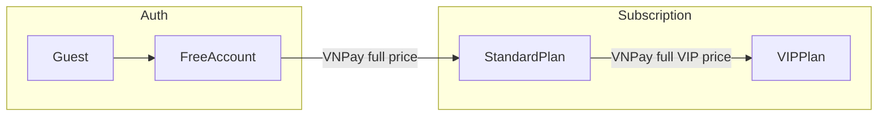

# Plan: Cập nhật Postman & Migrations theo context.txt

**Tham chiếu đề tài:** [`context.txt`](context.txt) (mục 0, C.4, C.5, B.2, B.4).

**Trạng thái triển khai:** Đã thực hiện migrations mới + cập nhật Postman collection. Chạy `php artisan migrate` / `migrate:fresh --seed` khi MySQL sẵn sàng.

---

## Tóm tắt thay đổi đã làm

### Database migrations (mới)

| File | Nội dung |
|------|----------|
| `2026_06_02_000001_rename_vip_packages_to_subscription_plans.php` | Đổi tên bảng + `plan_code`, `is_active` |
| `2026_06_02_000003_refactor_user_subscription_columns.php` | `subscription_plan_id`, `starts_at`, `expires_at`, `status` |
| `2026_06_02_000004_add_subscription_plan_to_transactions.php` | `subscription_plan_id`, `transaction_type`, index |
| `2026_06_02_000005_add_stream_fields_to_movies_table.php` | `stream_url`, `stream_source` |
| `2026_06_02_000006_update_comments_for_manual_moderation.php` | Bỏ `toxic_score`; thêm `hidden_at`, `hidden_by` |
| `2026_06_02_000007_create_homepage_blocks_table.php` | Bảng khối trang chủ |

### Seeders (mới)

- `RoleSeeder` — `admin`, `user`
- `SubscriptionPlanSeeder` — `standard` (79.000đ), `vip` (149.000đ)
- `DatabaseSeeder` gọi 2 seeder trên

### Postman

- Folder `VIP & Payment` → **`Subscription & Payment`**
- Endpoint gói: `GET /subscription/plans`
- Thanh toán: `plan_code`, request riêng **Upgrade to VIP** (full price)
- Admin: role `user`/`admin`; `PATCH .../subscription`; homepage-blocks
- Xóa: Approve Comment, Get AI Recommendations, Movies/Get Movies By Genre (trùng)
- Thêm: homepage blocks, AI chat history, mô tả stream errors

---

## Ma trận nghiệp vụ (context)

| Loại phim | Guest | Free | Standard | VIP |
|-----------|-------|------|----------|-----|
| is_premium=false | Không Play | Chặn Play | Play | Play |
| is_premium=true | Không Play | Chặn Play | Chặn | Play |

**Nâng cấp Standard → VIP:** thanh toán **toàn bộ** giá VIP, không prorate.

---

## Phần 1 — Database migrations (chi tiết)

### 1.1 Nguyên tắc

- **DB chưa migrate production:** `migrate:fresh --seed`
- **DB đã có dữ liệu:** chạy tuần tự migration `2026_06_02_*`; seed plans/roles

### 1.2 Bảng gói cước

- `vip_packages` → **`subscription_plans`**
- Thêm: `plan_code` (`standard` \| `vip`), `is_active`

### 1.3 Bảng `users`

- Bỏ: `vip_package_id`, `vip_expires_at`
- Thêm: `subscription_plan_id`, `subscription_starts_at`, `subscription_expires_at`, `subscription_status` (`none` \| `active` \| `expired`)

### 1.4 Bảng `transactions`

- `subscription_plan_id` (FK)
- `transaction_type`: `purchase` \| `upgrade`
- Index `(user_id, status)`

### 1.5 Bảng `movies`

- `stream_url`, `stream_source`

### 1.6 Bảng `comments`

- Bỏ `toxic_score`
- Thêm `hidden_at`, `hidden_by` (post-moderation)

### 1.7 Bảng `homepage_blocks`

- `title`, `source_type`, `source_ref`, `is_visible`, `sort_order`

### 1.8 Giữ nguyên

- `roles`, `ratings`, `movie_user`, `ai_chat_conversations`, `admin_activity_logs`

### 1.9 Thứ tự chạy

1. subscription_plans (rename)
2. users subscription
3. transactions
4. movies stream
5. comments
6. homepage_blocks
7. `php artisan db:seed`

---

## Phần 2 — Postman collection

Collection: [`postman/collections/Web Movie AI - Full API/`](postman/collections/Web%20Movie%20AI%20-%20Full%20API/)

### 2.1 Subscription & Payment

| Request | Endpoint / ghi chú |
|---------|-------------------|
| Get Subscription Plans | `GET /subscription/plans` |
| Create VNPay Payment | `plan_code`: standard \| vip |
| Create VNPay Payment - Upgrade to VIP | `plan_code: vip`, `transaction_type: upgrade`, full price |
| VNPay IPN / Return | Idempotent kích hoạt gói |

### 2.2 Admin User

- `PATCH /admin/users/{id}/role` — `user` \| `admin`
- `PATCH /admin/users/{id}/subscription` — chỉnh plan thủ công
- `GET /admin/users?plan=free|standard|vip`

### 2.3 Stream & Play

- `GET /movies/{id}/stream` — mô tả `require_login`, `require_subscription`, `require_vip_upgrade`
- `GET /movies/{id}/trailer` — public Guest OK

### 2.4 Homepage blocks

- `GET /homepage-blocks` (public)
- `GET/POST/PUT /admin/homepage-blocks`

### 2.5 Moderation

- Xóa Approve Comment
- `GET /admin/comments?status=visible|hidden`

### 2.6 Auth / AI

- `/auth/me`, `/user/profile` — document subscription fields
- `GET/DELETE /ai/chat/history`
- Xóa `/ai/recommendations`

### 2.7 Dọn trùng

- Giữ `GET /genres/{genre_id}/movies`; xóa bản trùng trong folder Movies

---

## Phần 3 — Checklist đồng bộ

| Hạng mục context | Migration | Postman |
|------------------|-----------|---------|
| Role User/Admin only | RoleSeeder | Admin Change Role |
| Plan Standard/VIP | subscription_plans | Subscription folder |
| Upgrade full price | transaction_type | Upgrade to VIP request |
| is_premium matrix | movies.is_premium | Stream description |
| Stream URL DB | stream_url | Admin Update Movie |
| Homepage blocks | homepage_blocks | homepage-blocks APIs |
| Post-moderation | bỏ toxic_score | Xóa Approve |
| Transactions + plan | subscription_plan_id | Admin transactions plan_code filter |

---

## Phần 4 — Thứ tự tiếp theo (backend code)

1. Chạy migrations + seed khi MySQL chạy
2. Cập nhật Eloquent models (`SubscriptionPlan`, User relations)
3. Implement Laravel routes khớp Postman
4. Cập nhật `STATUS-CODEBASE-BE1.md` và README ERD
5. Test collection: Auth → Plans → Stream → Admin

---

## Phần 5 — Rủi ro

- Rename `vip_packages` → đồng bộ Model/Factory nếu đã có code BE
- Drop `toxic_score` → sentiment dashboard dùng rule trên `content`
- Xóa route Approve Comment nếu đã implement BE
